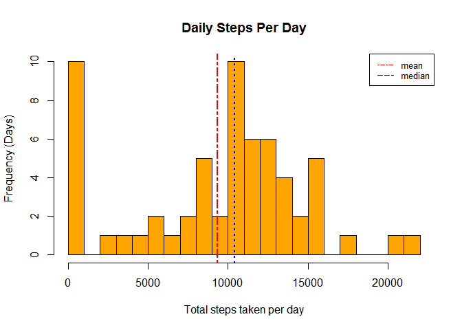
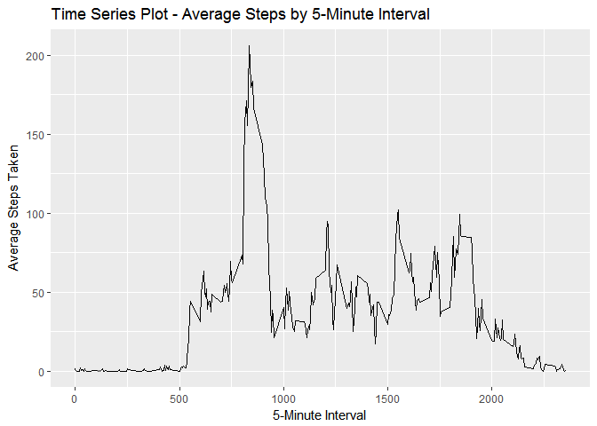
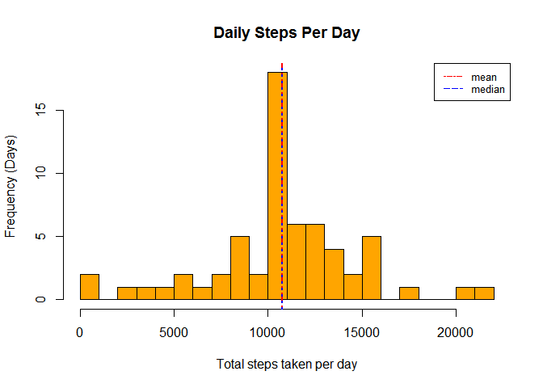
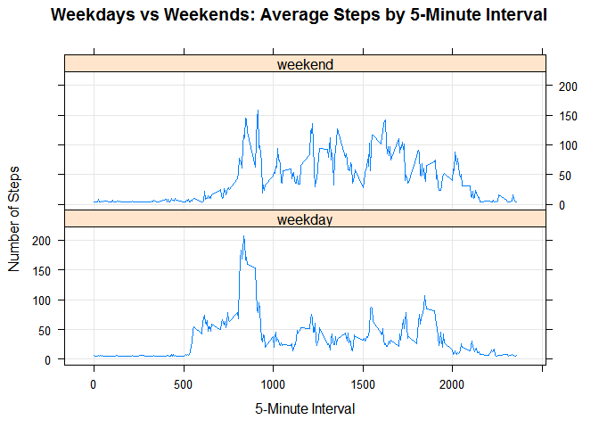

# Reproducible Research: Peer Assessment 1


This report has been generated as part of Project 1 for the Course 5 - Reproducible Research.

## Loading and preprocessing the data

The dataset for this project can be downloaded from the url provided. The following code looks for the csv file in the working directory. If the file is found it loads the csv into a data-frame and if the file is not found it downloads the data from the web, unzips and then loads the csv into a data-frame. As part of reading the data we also specify the classes of the columns this makes it easier for later processing. 


```r
#Check whether file exists in the working directory
if (!file.exists("activity.csv") )
	{
		urlActivity <- 'http://d396qusza40orc.cloudfront.net/repdata%2Fdata%2Factivity.zip'
		destZipFile <- "./repDataActivity.zip"
		download.file(urlActivity, destZipFile, mode='wb')  
		unzip(destZipFile)
	}

# Read in the data
dfActivity <- read.csv("./activity.csv", header=TRUE, na.strings = "NA", 
                     		colClasses = c("numeric", "Date", "numeric")) 
```

## What is mean total number of steps taken per day?

This part of the assignment calls for calculating the total number of steps. For this step it has been asked to ignore the NAs. We calculate the total steps by applying the "sum" function over the complete dataset using the tapply base method. 

We then utilize the hist function from the base plotting package to draw a histogram of frequency of steps taken per day. We also calculate the mean and median of the steps and report it. Also to make these mean and median values very obvious we plot these on the histogram that was just created. We utilize abline methodto add the lines (vertical) for the mean and median to overlay on top of the histogram. 


```r
#Ignoring NA's for this part of the assignment
#calculate the total steps
totalSteps <- with(dfActivity, tapply(steps, date, sum, na.rm=TRUE))
#Utilize the base package to draw a histogram
hist(totalSteps, breaks=20, col="orange", 
     xlab="Total steps taken per day", 
     ylab="Frequency (Days)", 
     main="Daily Steps Per Day")

#Calculate the mean of total number of steps
meanTotalSteps <- mean(totalSteps, na.rm = TRUE)
meanTotalSteps
```

```
## [1] 9354.23
```

```r
#Show the mean line on the histogram
abline(v=meanTotalSteps, lty=6, lwd=2, col="red")

#Calculate the median of total number of steps
medianTotalSteps <- median(totalSteps, na.rm = TRUE)
medianTotalSteps
```

```
## [1] 10395
```

```r
#Show the mean line on the histogram
abline(v=medianTotalSteps, lty=3, lwd=2, col="blue")

#Add Legend for the median and mode lines
legend('topright', legend=c("mean", "median"), col=c("red", "blue"), lty=6:3, cex=0.8)
```

<!-- -->

## What is the average daily activity pattern?

On the same dataset that we read in we average daily pattern by utilizing the aggregate method and function "mean". We use the ggplot method from ggplot2 package to draw a time series plot to show the activity pattern. 

Also we calculate the time interval with maximum average number of steps.


```r
#Calculate the avg. daily pattern - use the aggregate function from base R
dfAvgDailyPattern <- with (dfActivity, aggregate(steps, by=list(interval), FUN=mean, na.rm=TRUE))
#Update the column names for the data frame generated
names(dfAvgDailyPattern) <- c("interval", "averagesteps")

#Utilize - ggplot2 to draw the time series plot
library(ggplot2)

ggplot(dfAvgDailyPattern, aes(interval, averagesteps)) + 
    geom_line() +
		xlab("5-Minute Interval") +
		ylab("Average Steps Taken") + 
		ggtitle("Time Series Plot - Average Steps by 5-Minute Interval")
```

<!-- -->

```r
#Compute which 5-minute interval, on average across all the days in the dataset, 
#contains the maximum number of steps?

dfAvgDailyPattern[which.max(dfAvgDailyPattern$averagesteps), c("interval")]
```

```
## [1] 835
```

## Imputing missing values

For this part of the assignment, we can no longer ignore NAs, so we are imputing. First we report the number of NAs in our dataset. To impute the NAs we utilize transform method and populate the NA values with the mean of number of steps. We calculate the number of NAs again to confirm all the NAs are removed. With this imputed data-frame we again calculate the total steps by applying the "sum" function over the complete dataset using the tapply base method. 

We then utilize the hist function from the base plotting package to draw a histogram of frequency of steps taken per day. We also calculate the mean and median of the steps and report it. Also to make these mean and median values very obvious we plot these on the histogram that was just created. We utilize abline methodto add the lines (vertical) for the mean and median to overlay on top of the histogram. 


```r
#Calculate and report the total number of missing values in the dataset 
#(i.e. the total number of rows with NAs)
sum(is.na(dfActivity$steps))
```

```
## [1] 2304
```

```r
#Strategy for filling in all of the missing values in the dataset - use mean of the steps

#New dataset that is equal to the original dataset but with the missing data filled in
dfActivityImputed <- transform(dfActivity, steps = ifelse(is.na(steps), mean(steps, na.rm=TRUE), steps))

#Confirm there are no NA's in data
sum(is.na(dfActivityImputed$steps))
```

```
## [1] 0
```

```r
#calculate the total steps
totalStepsImputed <- with(dfActivityImputed, tapply(steps, date, sum, na.rm=TRUE))
#Utilize the base package to draw a histogram
hist(totalStepsImputed, breaks=20, col="orange", 
     xlab="Total steps taken per day", 
     ylab="Frequency (Days)", 
     main="Daily Steps Per Day")

#Calculate the mean of total number of steps
meanTotalStepsImputed <- mean(totalStepsImputed, na.rm = TRUE)
meanTotalStepsImputed
```

```
## [1] 10766.19
```

```r
#Show the mean line on the histogram
abline(v=meanTotalStepsImputed, lty=6, lwd=2, col="red")

#Calculate the median of total number of steps
medianTotalStepsImputed <- median(totalStepsImputed, na.rm = TRUE)
medianTotalStepsImputed
```

```
## [1] 10766.19
```

```r
#Show the mean line on the histogram
abline(v=medianTotalStepsImputed, lty=3, lwd=2, col="blue")

#Add Legend for the median and mode lines
legend('topright', legend=c("mean", "median"), col=c("red", "blue"), lty=6:3, cex=0.8)
```

<!-- -->

```r
#NOTE:
#The the values differ from the estimates from the first part of the assignment
#The mean and median both increase as there is no missing data in the date frame and they have values 
#equal to average of all the steps
```


## Are there differences in activity patterns between weekdays and weekends?

To check on differences in activity patterns between weekdays and weekends - we first process the dataset and add a new column day and populate it with value "weekday" or "weekend" based on the Date column. 

We then utilize the xyplot menthod from lattice package to plot the panels as provided in the sample. From the two plots we can easily see that there are differences - for a weekday there is less activity as people might be at work and doing their day jobs (possibly sitting) compared to a weekend. 


```r
#Add a new column day and default to "weekday"
dfActivityImputed$day <- "weekday"
#Go over the dates and for those falling over the weekend - mark them as weekend
dfActivityImputed$day[weekdays(as.Date(dfActivityImputed$date)) %in% c("Saturday","Sunday")] <- "weekend"

#Utilize lattice - to draw the time series plot
library(lattice)

#Calculate the avg. daily pattern - use the aggregate function from base R
dfAvgDailyPatternImputed <- with (dfActivityImputed, aggregate(steps, by=list(interval, day), FUN=mean, na.rm=TRUE))
#Update the column names for the data frame generated
names(dfAvgDailyPatternImputed ) <- c("interval", "day", "averagesteps")

xyplot(averagesteps ~ interval | day, 
       data=dfAvgDailyPatternImputed, type="l", grid=TRUE, layout=c(1,2), 
       ylab="Number of Steps", 
       xlab="5-Minute Interval", 
       main="Weekdays vs Weekends: Average Steps by 5-Minute Interval")
```

<!-- -->

